# Digital Logic Circuits

## Gates

### AND Gate
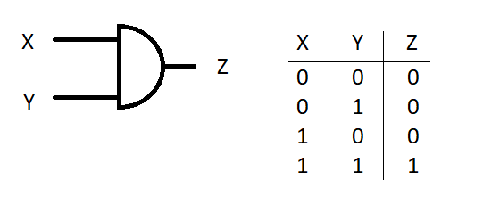

### OR Gate
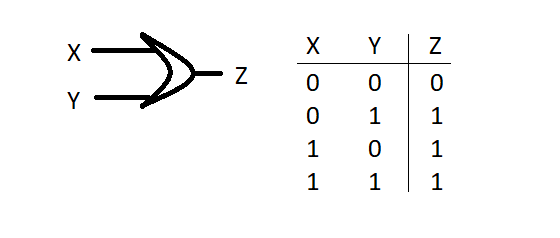

### Not Gate
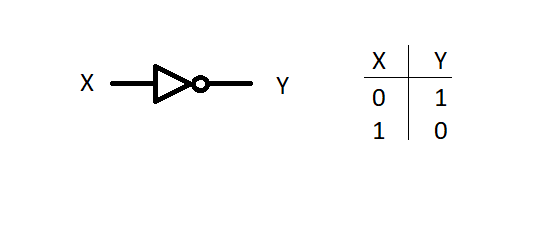

### Nand Gate
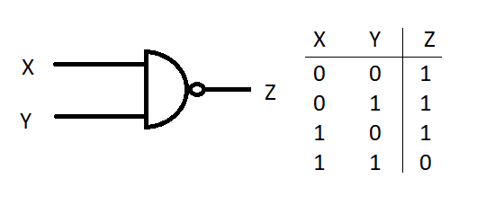

### Nor Gate
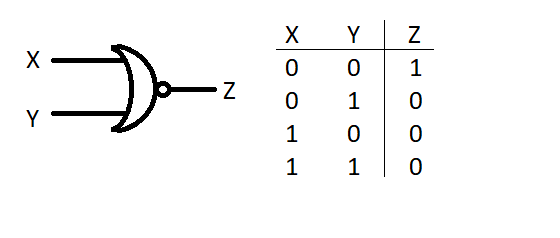

### XOR Gate
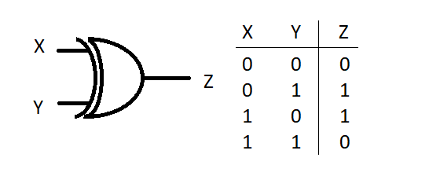

### XNOR Gate
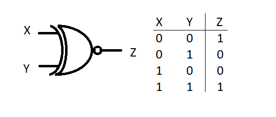

---

## Adders

### Half Adder

### Full Adder

---

## Multiplexer

### 2x1 MUX

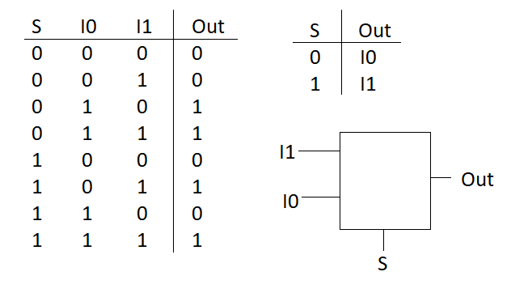
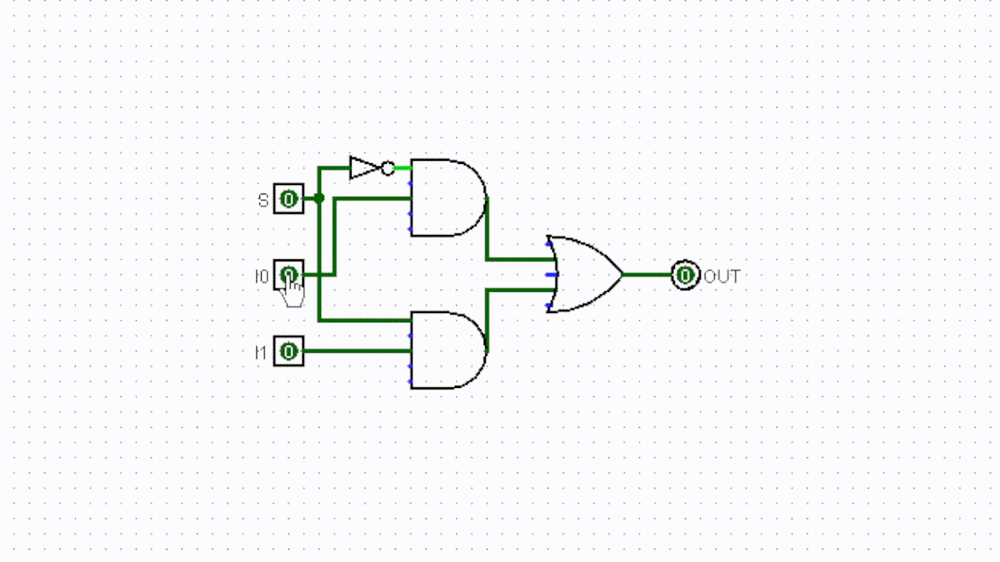

### 4x1 MUX using 2x1 MUX

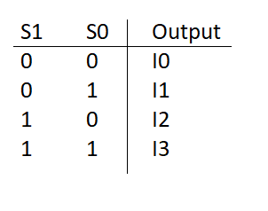
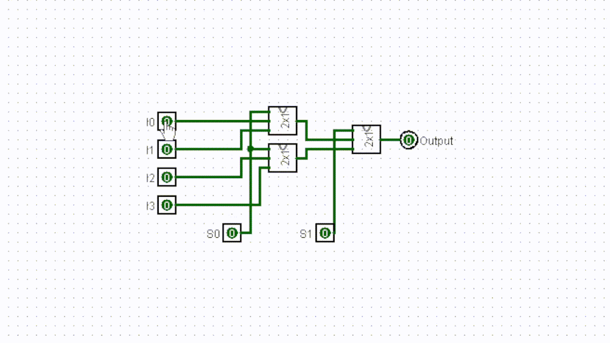

## Memory Latches / Flip-Flops

### SR NAND Latch

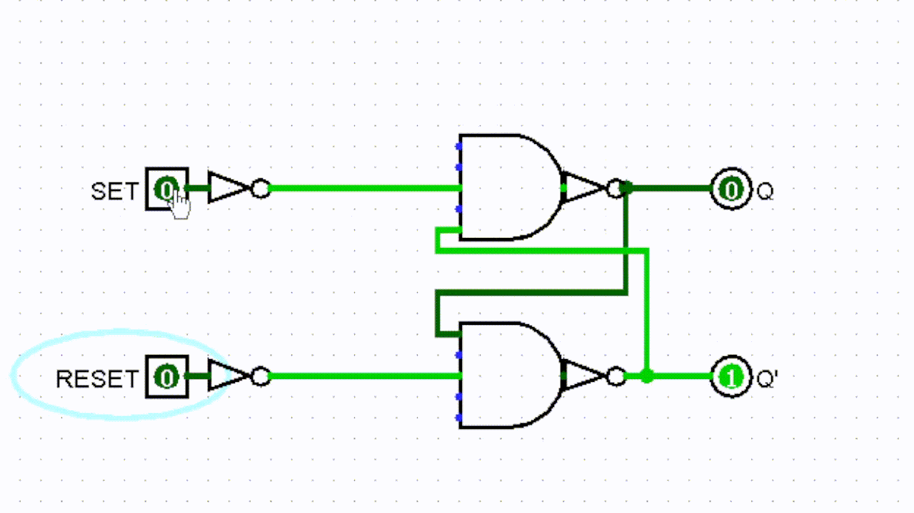

### JK NAND Flip Flop

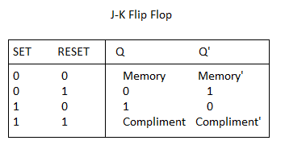
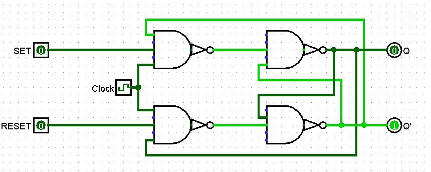