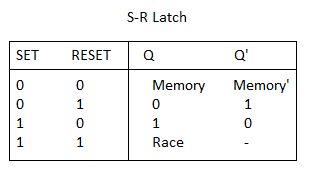

# Digital Logic Circuits

## Gates

### AND Gate

### OR Gate

### Not Gate

### Nand Gate

### Nor Gate

### XOR Gate

### XNOR Gate

---

## Adders

### Half Adder

### Full Adder

---

## Multiplexer

### 2x1 MUX

### 4x1 MUX using 2x1 MUX

## Memory Latches / Flip-Flops

### SR NAND Latch

### JK NAND Flip Flop

